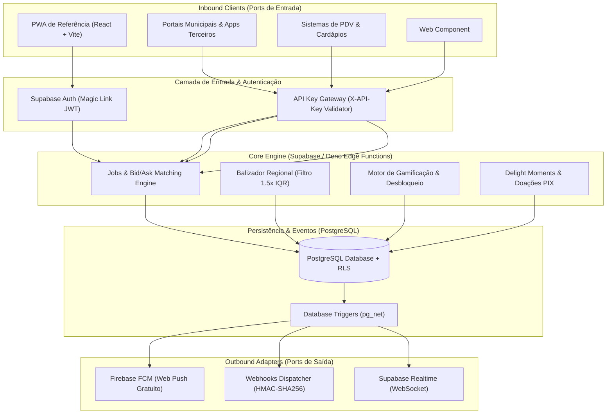
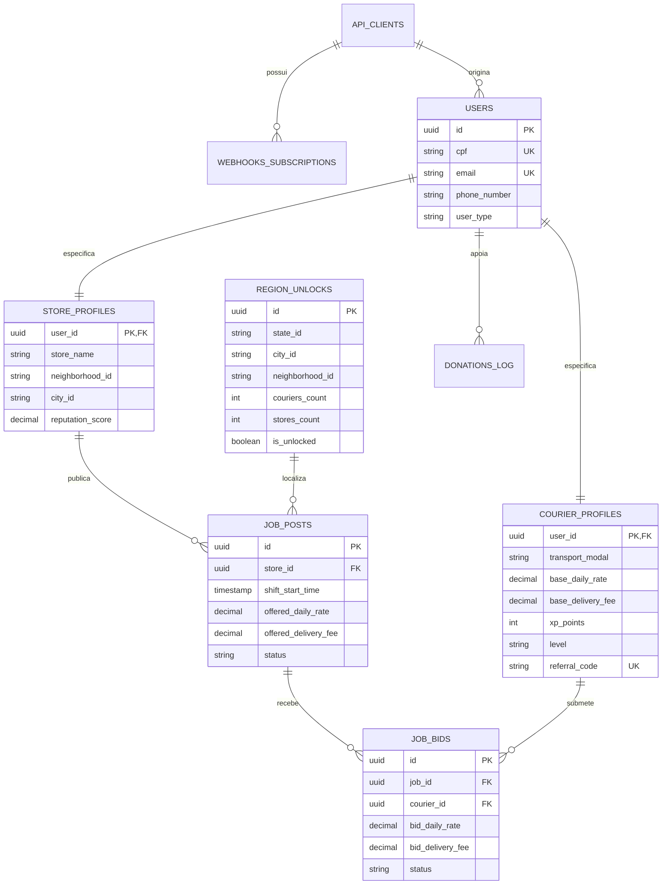

# Architecture Spine — deLIVREry

## Design Paradigm

O sistema adota **Hexagonal (Ports & Adapters) combinado a Event-Driven Serverless** sobre infraestrutura Supabase (PostgreSQL + Auth + Edge Functions + Realtime).

O **Core Engine** é estritamente neutro e desacoplado:
1. **Core Domain (Invariants):** Regras de matching Bid/Ask, cálculo IQR de balizador regional, algoritmo de XP/gamificação, validação anti-manipulação e regras de desbloqueio territorial.
2. **Inbound Adapters (Ports de Entrada):**
   - Headless REST API (`/api/v1/*`) para sistemas de terceiros, PDVs e portais municipais (autenticados via `X-API-Key`).
   - Supabase PostgREST / GraphQL client para o PWA oficial de referência (autenticado via JWT de Magic Link).
   - Componente Web nativo `<delivrery-button />` (Vanilla JS Web Component para cardápios digitais).
3. **Outbound Adapters (Ports de Saída):**
   - PostgreSQL RLS (Row Level Security) e Views analíticas materializadas.
   - Dispatcher de Webhooks de saída assinado com HMAC-SHA256.
   - Provedor Web Push FCM (Firebase Cloud Messaging) e Realtime Channels.
   - Provedor PIX Estático (Payloads BR Code Copia e Cola configuráveis via variáveis de ambiente).



---

## Invariants & Rules

### AD-1 — [ADOPTED] Desacoplamento API-First & Headless Engine
- **Binds:** `FR-3`, `FR-16`, `FR-18`, todos os endpoints e clientes.
- **Prevents:** Acoplamento do backend ao frontend PWA oficial ou regras de negócio embutidas no client-side.
- **Rule:** O Core Engine opera exclusivamente via API REST e Edge Functions sobre Supabase. O PWA oficial é um consumidor da API pública com os mesmos privilégios de clientes parceiros autenticados.

### AD-2 — [ADOPTED] Modelo P2P Zero-Custódia Financeira
- **Binds:** `FR-4`, `FR-5`, `FR-10`.
- **Prevents:** Risco de intermediação financeira, necessidade de licença bancária/split de pagamento e cobrança de taxas em transações.
- **Rule:** A plataforma nunca processa, retém ou liquida dinheiro de entregas. Todo o pagamento é feito diretamente do comerciante para o entregador via PIX/dinheiro. O sistema registra apenas confirmações mútuas de execução de turno.

### AD-3 — [ADOPTED] Subsistema de Doação PIX Estática em Delight Moments
- **Binds:** `FR-10`, `FR-11`, `FR-12`.
- **Prevents:** Custos de APIs de gateways de pagamento bancário e dependência de checkout externo.
- **Rule:** O modal de Delight Moment consome a Chave PIX estática configurada (`PUBLIC_PIX_KEY` / `PUBLIC_PIX_BRCODE_PAYLOAD`), copia para o clipboard com feedback tátil e registra o log anônimo em `donations_log` sem bloquear o fluxo do usuário.

### AD-4 — [ADOPTED] Motor de Precificação Estatística com Filtro 1.5×IQR
- **Binds:** `FR-7`, `FR-8`, `FR-9`.
- **Prevents:** Distorção predatória de preços por cartéis, ofertas anômalas ou wash bidding.
- **Rule:** Estatísticas públicas de mercado ($P_{min}, P_{med}, P_{max}$) são calculadas no PostgreSQL excluindo valores fora de $[Q_1 - 1.5 \times \text{IQR}, Q_3 + 1.5 \times \text{IQR}]$. Tarifas base de usuários possuem trava de velocidade máxima de $\pm 30\%$ em janela de 12 horas.

### AD-5 — [ADOPTED] Notificações de Saída Assinadas via Webhook (Event-Driven)
- **Binds:** `FR-17`.
- **Prevents:** Insegurança em integrações de parceiros e dependência de polling síncrono.
- **Rule:** Eventos (`job.created`, `bid.submitted`, `job.accepted`, `job.completed`) disparam requisições HTTP POST assíncronas com cabeçalho `X-Signature-SHA256` gerado via HMAC com o `secret_token` do integrador.

### AD-6 — [ADOPTED] Pilha de Comunicação Zero-Custo Operacional
- **Binds:** `FR-4`, `FR-13`.
- **Prevents:** Gastos recorrentes com provedores pagos de SMS, WhatsApp Business API ou plataformas proprietárias de push.
- **Rule:** Toda a comunicação é feita via Firebase Cloud Messaging (Web Push PWA gratuito), canais de Realtime WebSocket do Supabase e Caixa de Notificações In-App persistida no banco.

### AD-7 — [ADOPTED] Autenticação Passwordless via Magic Link
- **Binds:** `FR-1`, `FR-2`.
- **Prevents:** Vazamento de senhas, fricção de login para motoboys em trânsito e custos de autenticação por SMS.
- **Rule:** Usuários finais autenticam-se exclusivamente via token Magic Link no e-mail com persistência de JWT no client.

### AD-8 — [ADOPTED] Estrutura Geográfica Universal e Desbloqueio Orgânico
- **Binds:** `FR-2`, `FR-13`, `FR-15`.
- **Prevents:** Bloqueio territorial regional ou acoplamento a um único município piloto.
- **Rule:** O banco e as Landing Pages suportam dinamicamente a árvore `(state_id, city_id, neighborhood_id)` para todo o território nacional. Qualquer bairro transiciona para ativo ao atingir 10 lojas + 50 motoboys.

### AD-9 — [ADOPTED] Componente Web Nativo Embutível (<delivrery-button />)
- **Binds:** `FR-18`.
- **Prevents:** Sobrecarga de frameworks em sites de parceiros e incompatibilidades de versão.
- **Rule:** O widget de integração de cardápios é distribuído como Web Component puro em JavaScript ES6 sem frameworks auxiliares.

### AD-10 — [ADOPTED] Segurança Granular via Row Level Security (RLS)
- **Binds:** Todos os FRs de dados.
- **Prevents:** Acesso indevido a dados de terceiros, vazamento de telefones fora de matching ativo e fraudes em bids.
- **Rule:** Toda tabela do PostgreSQL possui RLS ativo por padrão. Usuários só leem dados públicos de vagas abertas e seus próprios perfis. Dados de contato direto só são expostos na tabela `job_posts` quando `status = 'matched'`.

---

## Consistency Conventions

| Preocupação | Convenção |
| :--- | :--- |
| **Nomenclatura de Tabelas e Colunas** | `snake_case` no PostgreSQL (`courier_profiles`, `base_daily_rate`, `city_id`). |
| **Nomenclatura de Endpoints REST** | `kebab-case` pluralizado (`/api/v1/job-posts`, `/api/v1/pricing-stats`). |
| **Identificadores Únicos** | UUIDv4 gerados via `gen_random_uuid()` para todas as entidades principais. |
| **Formatos de Data e Hora** | ISO 8601 UTC (`2026-08-21T18:00:00Z`) com armazenamento em `TIMESTAMPTZ`. |
| **Formato de Erro de API** | RFC 7807 Problem Details (`{ "type": "https://delivrery.app.br/errors/rate-limit", "title": "...", "status": 429, "detail": "..." }`). |
| **Autenticação em Headers** | `Authorization: Bearer <JWT>` para usuários finais; `X-API-Key: dlv_live_<hash>` para parceiros B2B. |

---

## Stack

| Camada / Componente | Tecnologia | Versão Pinned |
| :--- | :--- | :--- |
| **Database & Engine** | Supabase (PostgreSQL + RLS) | `PostgreSQL 15+` |
| **Serverless Runtime** | Supabase Edge Functions (Deno) | `Deno 1.40+` |
| **Autenticação** | Supabase Auth (GoTrue) | `v2.x` |
| **Frontend PWA & Landing Pages** | React + Vite + TypeScript | `React 18.3+` / `Vite 5.x` |
| **Push Notifications** | Firebase Cloud Messaging (Web Push) | `FCM v9+` |
| **Web Component** | Vanilla JavaScript (Custom Elements v1) | `ES2022` |
| **Documentação Interativa** | OpenAPI 3.0 / Swagger UI | `v3.0.3` |

---

## Structural Seed

### 1. Estrutura de Diretórios do Repositório

```text
deLIVREry/
├── .agent/                    # Configurações e skills do BMad / Antigravity
├── _bmad-output/              # Artefatos de planejamento (PRD, Arquitetura, Keepsakes)
├── supabase/                  # Definições do Core Engine
│   ├── functions/             # Edge Functions em TypeScript/Deno
│   │   ├── pricing-stats/     # Cálculo estatístico IQR em tempo real
│   │   ├── webhook-dispatch/  # Despachador de Webhooks com HMAC
│   │   └── fcm-notify/        # Envio de notificações Web Push FCM
│   └── migrations/            # DDL SQL versionado (tabelas, triggers, RLS)
├── apps/
│   ├── landing-pages/         # Landing Pages A/B/C Universais (Vite + React)
│   ├── pwa/                   # PWA Oficial de Referência para Lojistas e Motoboys
│   └── developer-portal/      # Portal do Desenvolvedor (/developers com Swagger)
└── packages/
    ├── embed-widget/          # Web Component <delivrery-button />
    └── api-client-sdk/        # SDK TypeScript/JavaScript neutro
```

### 2. Diagrama de Relacionamento de Entidades (ERD)



---

## Capability → Architecture Map

| Capacidade / Requisito | Onde Vive no Código | Governado Por |
| :--- | :--- | :--- |
| **Auth Passwordless (`FR-1`, `FR-2`)** | `supabase/migrations/01_auth.sql` & `apps/pwa/src/auth` | `AD-7`, `AD-8` |
| **API Keys & Headless (`FR-3`, `FR-16`)** | `supabase/functions/api-gateway` & `apps/developer-portal` | `AD-1`, `AD-10` |
| **Gestão de Vagas & Bids (`FR-4`, `FR-5`, `FR-6`)** | `supabase/migrations/02_jobs_bids.sql` & `apps/pwa/src/jobs` | `AD-1`, `AD-2` |
| **Balizador de Preço IQR (`FR-7`, `FR-8`, `FR-9`)** | `supabase/functions/pricing-stats` & SQL Views | `AD-4` |
| **Delight Moments & PIX (`FR-10`, `FR-11`, `FR-12`)** | `apps/pwa/src/components/DonationModal.tsx` | `AD-3` |
| **Desbloqueio & Gamificação (`FR-13`, `FR-14`, `FR-15`)** | `supabase/migrations/03_gamification.sql` & Landing Pages | `AD-8` |
| **Webhooks de Saída (`FR-17`)** | `supabase/functions/webhook-dispatch` | `AD-5` |
| **Web Component `<delivrery-button />` (`FR-18`)** | `packages/embed-widget/src/delivrery-button.js` | `AD-9` |

---

## Deferred

1. **Roteirização Multi-Ponto Inteligente:** O algoritmo de empacotamento de múltiplas entregas por rota é diferido para a v2 e viverá como uma Edge Function dedicada (`supabase/functions/routing-optimizer`).
2. **Integração com Gateway de PIX Dinâmico com Webhook Bancário:** Diferido até que a comunidade atinja escala que justifique a automação de conciliação bancária de doações.
3. **App Nativo Mobile (iOS/Android):** O PWA foi validado como suficiente para a v1; wrappers em Capacitor/React Native ficam para a v2.
